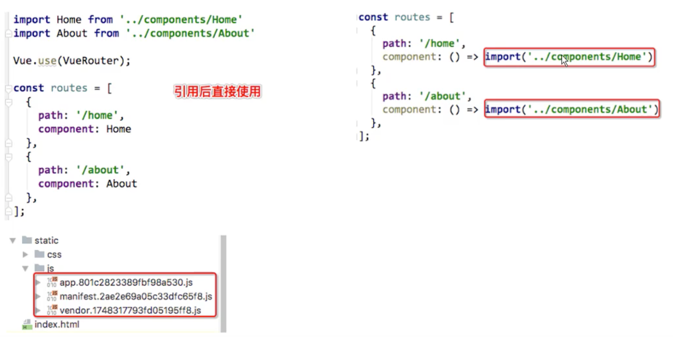

#   1. 路由懒加载
-   用到的时候在加载
```angular2html
  {
    path: '/',
    name: 'Home',
    component: Home
  },
  {
    path: '/user/:userId',
    name: 'User',
    component: User
  },
```

##  1.1 实现懒加载
```angular2html
import Vue from 'vue'
import VueRouter from 'vue-router'
// import Home from '../views/Home.vue'
// import About from "../components/About";
// import User from "../components/User";
Vue.use(VueRouter)
const routes = [
  {
    path: '/',
    name: 'Home',
    component: () => import('../views/Home')
  },
  {
    path: '/user/:userId',
    name: 'User',
    component: () => import('../components/User')
  },
  {
    path: '/about',
    name: 'About',
    component: () => import('../components/About')
  }
]
```